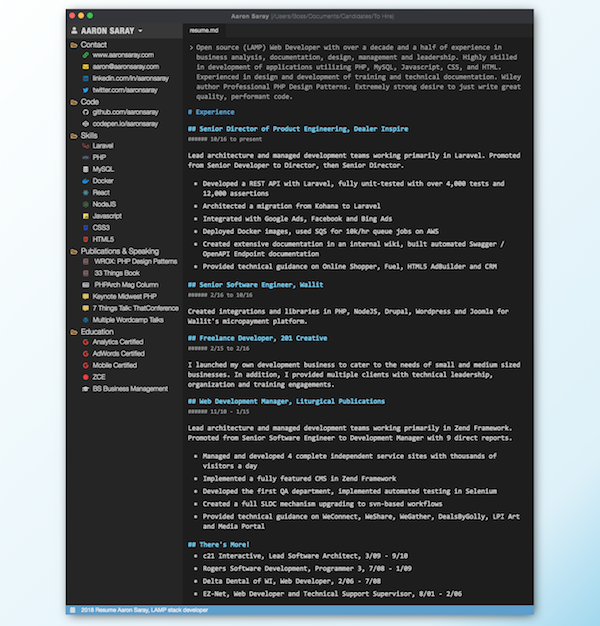

# Resume of Aaron Saray

Check out the PDF Release at Resume of Aaron Saray.pdf above.

## Nerd Stuff

I use HTML and CSS to create a webpage of the resume. Then, I print in Chrome to PDF, including background colors and removing any margins. Boom - PDF!

I only tested it in Google Chrome on Mac, the most recent update. It's not meant to be cross browser or surfable at this time. However, I did want to make it look just a bit more pretty when I was working on it. Below you can see the screenshot.

